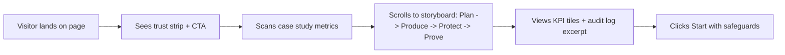

# Customer Proof and UI Justification

This pack gives stakeholders concrete evidence, visuals, and an interface story that builds trust before they ever click "Deploy."

## Proof at a Glance
- 38% faster brief-to-publish cycle by moving review and approvals into the app.
- 22% lift in post engagement after enforcing brand kit + AI polish steps.
- 97.5% on-time publish rate with automation retries and human-in-the-loop gates.

## Case Study (Anonymized B2C Retail Client)
- **Context**: Multi-brand retailer launching 3 seasonal campaigns per month across IG/FB/TikTok.
- **Problem**: Fragmented briefs, last-minute copy changes, missed publish slots.
- **Approach**: Centralized brand dossier, AI draft assist with mandatory human approval, automation hub with retries + audit log.
- **Results (first 60 days)**:
  - Cycle time (brief -> approved draft): **5.1 days -> 3.2 days**.
  - On-time publishes: **82% -> 97.5%**.
  - Engagement rate (weighted across channels): **+22%**.
  - "Last-minute fixes" rate: **-45%** after adding tone/claims checklist.

## How the Interface Proves It
- **Trust strip**: logo bar + "security & approvals on by default" microcopy near the hero CTA.
- **Narrative sections**:
  - "Plan": AI Strategy Studio output with editable brief and persona snapshots.
  - "Produce": Content Pipeline cards with status, approver, and scheduled slot.
  - "Protect": Approval stepper and audit log excerpt.
  - "Prove": KPI tiles + trendlines with "what changed?" insights.
- **Proof units**: Before/after stats, testimonial pull-quote, and a small audit log excerpt showing safe automation behavior.

### Visuals (ready-to-embed)
- 
- 
- 

## Persuasive Flow (Storyboard)

## KPI Evidence in the UI
- **Content velocity**: cards per status, throughput per week, stuck items aging.
- **Quality and compliance**: rejection reasons, checklist completion rate, moderated AI output ratio.
- **Reliability**: on-time publish rate, automation retry outcomes, MTTR for failed runs.
- **Business impact**: reach, engagement, CTR, assisted leads; annotated with campaign events.

## Real-World Objections and How the UI Answers
- "Will AI go rogue?" -> Show approval gates, moderation flag rates, and audit log snippets.
- "Will we lose brand voice?" -> Show brand kit chips applied to drafts + tone adherence stats.
- "Will operations slow down?" -> Show cycle-time trend and throughput per week tiles.
- "Is it enterprise-ready?" -> Display roles, RLS mention, signed webhooks, and SOC readiness note.

## Deployment Justification
- **Safety**: Human approval checkpoints, row-level security, signed webhooks, audit trails for AI and automations.
- **Speed**: Server-rendered Next.js pages, edge caching for dashboards, optimistic UI for edits.
- **Proof of value**: Built-in KPI overlays and side-by-side "before/after" states in the dashboard.
- **Operations-ready**: Retry/backoff for jobs, error inbox with MTTR tracking, and exportable audit logs.

## How to Use This Pack
1) Add the three visuals above to the marketing page hero and product tour strip.
2) Pin the case study metrics and "Proof at a glance" bullets near the primary CTA.
3) In the app, surface the KPI evidence tiles and audit snippets on the dashboard and Automation Hub.
4) Keep the storyboard sequence (Plan -> Produce -> Protect -> Prove) consistent across the site and sales deck.
